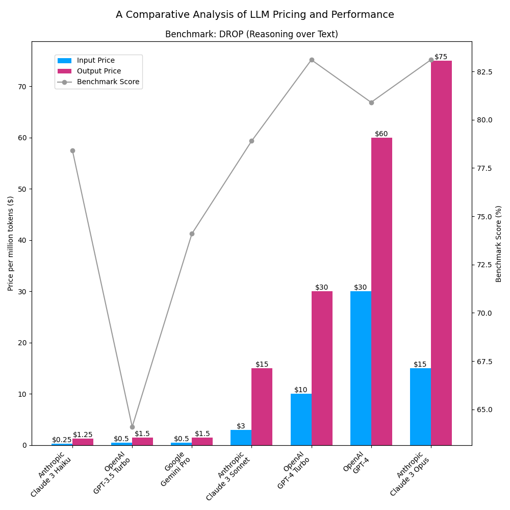

# LLM Price Comparison

A comparison of the price per million tokens and benchmark scores of various large language models.

Google Gemini Pro has been adjusted from a per-character price to a per-token estimate by simply multiplying by four.

## Benchmark

The benchmark used is the [DROP](https://allenai.org/data/drop) benchmark, which measures the ability of a model to reason over text, as reported by Anthropic: https://twitter.com/AnthropicAI/status/1764653830468428150?t=PVCce7q9pT-aiwsUd1w9tg&s=19

The GPT-4 Turbo DROP benchmark came from this post: https://bito.ai/blog/gemini-1-5-pro-vs-gpt-4-turbo-benchmarks/

## Chart

